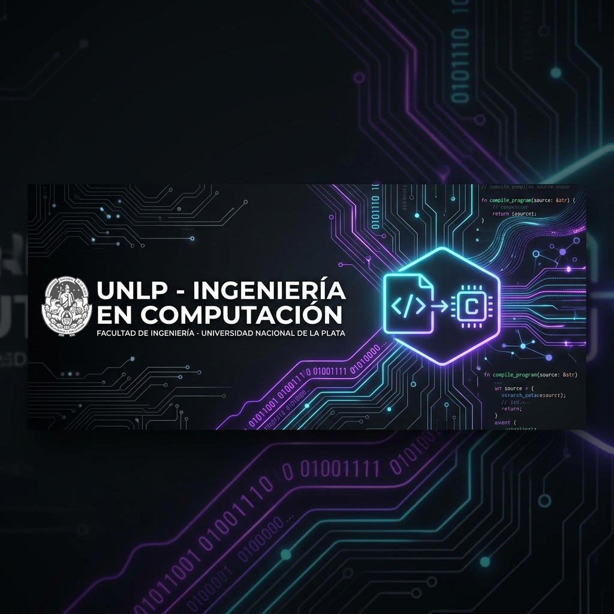

# UNLP Ingeniería en Computación — Bitácora Académica 🎓🚀

  

  
  
  

---

## 🌟 Sobre este Repositorio
Este espacio es mi **bitácora y portafolio académico** personal. Aquí guardo, organizo y documento todas las prácticas, laboratorios, proyectos y notas de estudio a lo largo de mi carrera de **Ingeniería en Computación** en la **Universidad Nacional de La Plata (UNLP)**, comenzando desde el día uno del semestre 1.

La meta de este repositorio es doble:
1. **Historial de Progreso:** Registrar mi evolución técnica, desde mis primeros algoritmos estructurados en Pascal hasta arquitecturas de hardware, sistemas operativos, computación cuántica y proyectos complejos.
2. **Portafolio Profesional:** Servir como una vitrina abierta al mundo para que reclutadores y empresas tecnológicas aprecien de primera mano mi dedicación, nivel de organización y calidad de código.

Aunque tambien estoy abierto a ayudar a cualquier estudiante que haya ingresado a mi misma carrera, para que pueda revisar en lo que sea que tenga dudas :)

---

## 🎮 Progreso de la Carrera (Grado + Posgrado)
Aca tienes el avance general de mi viaje académico (estimado en 13 semestres incluyendo posgrado):

* **Progreso General:** `[█░░░░░░░░░░░░] 7.6%` (1 de 13 semestres completados/en curso) 🎓

---

## 🗂️ Estructura del Repositorio (Mapa de Materias)

El repositorio ahora está organizado por **semestres**. Puedes hacer clic en los enlaces de las carpetas para explorar las materias:

### 🎓 1º Año
* **Semestre 1:**
  * 🟢 **[Programación I (Pascal)](./semestre-1/programacion-I/)** — *Resoluciones de prácticas, módulos y estructuras de datos.*
  * 🟡 **[Fundamentos de Arquitectura de Computadoras (FAC)](./semestre-1/fundamentos-arquitectura/)** — *Circuitos, microarquitectura, Assembler.*
* **Semestre 2:**
  * 🟤 **[Programación II](./semestre-2/programacion-II/)**

### 🎓 2º Año
* **Semestre 3:**
  * 🟤 **[Programación III](./semestre-3/programacion-III/)**
  * 🟤 **[Arquitectura de Computadoras](./semestre-3/arquitectura-computadoras/)**
  * 🟤 **[Taller de Lenguajes I](./semestre-3/taller-lenguajes-I/)**
* **Semestre 4:**
  * 🟤 **[Conceptos de Sistemas Operativos](./semestre-4/conceptos-sistemas-operativos/)**
  * 🟤 **[Taller de Lenguajes II](./semestre-4/taller-lenguajes-II/)**

### 🎓 3º Año
* **Semestre 5:**
  * 🟤 **[Conceptos de Bases de Datos](./semestre-5/conceptos-bases-de-datos/)**
  * 🟤 **[Electrotecnia y Electrónica](./semestre-5/electrotecnia-electronica/)**
  * 🟤 **[Introducción al Diseño Lógico](./semestre-5/intro-diseno-logico/)**
* **Semestre 6:**
  * 🟤 **[Introducción al Procesamiento de Señales](./semestre-6/intro-procesamiento-senales/)**
  * 🟤 **[Redes de Datos I](./semestre-6/redes-datos-I/)**
  * 🟤 **[Bases de Datos](./semestre-6/bases-de-datos/)**
  * 🟤 **[Circuitos Digitales y Microcontroladores](./semestre-6/circuitos-digitales-microcontroladores/)**

### 🎓 4º Año
* **Semestre 7:**
  * 🟤 **[Taller de Arquitectura de Computadoras](./semestre-7/taller-arquitectura/)**
  * 🟤 **[Ingeniería de Software](./semestre-7/ingenieria-software/)**
  * 🟤 **[Instrumentación y Control](./semestre-7/instrumentacion-control/)**
  * 🟤 **[Redes de Datos II](./semestre-7/redes-datos-II/)**
* **Semestre 8:**
  * 🟤 **[Sistemas en Tiempo Real](./semestre-8/sistemas-tiempo-real/)**
  * 🟤 **[Concurrencia y Paralelismo](./semestre-8/concurrencia-paralelismo/)**

### 🎓 5º Año
* **Semestre 9:**
  * 🟤 **[Sistemas Distribuidos y Paralelos](./semestre-9/sistemas-distribuidos-paralelos/)**
* **Semestre 10:**
  * 🟤 **[Introducción a la Programación Cuántica](./semestre-10/intro-arquitectura-cuantica/)**

### 🚀 Otros
* **[Materias Optativas](./materias-optativas/)**
* **[Proyectos Finales y de Taller](./proyectos-finales/)**

---

## 🛠️ Tecnologías y Lenguajes en Uso
A medida que avance la carrera, el repositorio sumará soporte para múltiples tecnologías:

  
  
  
  
  

---

## 📬 Contacto
Si eres estudiante de la UNLP, estás cursando las mismas materias y te sirve alguna resolución, ¡siéntete libre de husmear! Y si tienes alguna sugerencia o quieres charlar sobre la carrera:

* **Autor:** Ciro Viola
* **Universidad:** Universidad Nacional de La Plata (UNLP)
* **Carrera:** Ingeniería en Computación

---

  <i>"Si quieres algo ve y haz que pase, porque lo unico que cae del cielo, es la lluvia."</i> 

